# Question 1
We heat up polymer during injection moulding, in order to:

A) Increase the viscosity

B) Reduce the viscosity

C) Increase friction

D) Reduce heat capacity

# Question 2
When we design an injection moulded part:

A) We always keep the wall thickness as uniform as possible

B) We should make corners sharp to improve the product quality

C) We always keep wall thickness as big as possible to keep melt flow in the mould

D) We should set the wall thickness different on the part to reduce warpage

# Question 3
When we design the gate for injection moulding:

A) The gate should be located at the thinnest wall position to increase the pressure when enter the mould

B) The gate will be the last place to freeze across the entire thickness

C) The gate should be located at the thickest wall position to reduce the pressure loss

D) The gate should be as small as possible so it won't affect the aesthetics of the part

# Question 4
Snap fit (a)
The figure is a stress-strain curve of a thermoplastic material. If we apply this plastic for a snap fit design, what is the strain level that you recommend, assuming the snap fit is required to be engaged more than once.
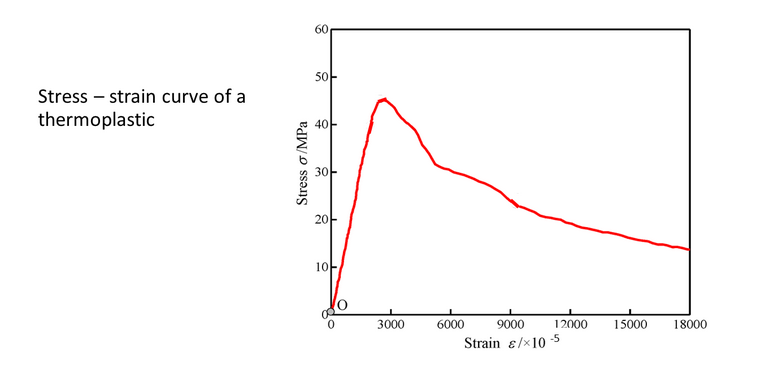

A) strain ε < 2.1%

B) strain ε < 1.8%

C) strain ε < 1.5%

D) strain ε < 1.26%

# Question 5
Snap fit (b)
The figure shows a snap fit, the material mentioned in previous question is used in this design. What is the recommendation for the dimension of length, if the snap fit will be engaged more than once, and the defection will be 0.2 mm
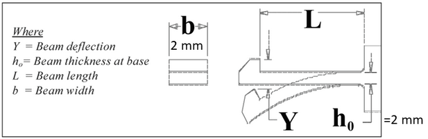

A) Length L > 6.9 mm

B) Length L < 6.9 mm

C) Lengh L > 5.3 mm

D) Length L < 5.3 mm

# Question 6
Hinge - (a)
The figure illustrates a failed integral hinge. Please read the following solutions for the design of hinge and select the WRONG statement:
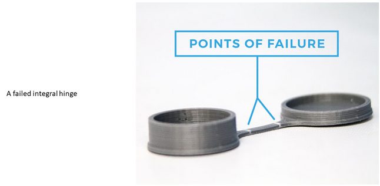

A) The materials should be changed to another type that can withstand high stresses

B) The materials should be changed to another type that can withstand high strains

C) This problem will be fixed by increasing the thickness of the hinge

D) The gate of injection should be carefully chosen to avoid weld lines on the hinge

# Question 7
Hinge - (b)
If POM hostaform C 9021 is used for the previous design, in order to achieve the function as a cap (to be close and open more than 1 million times), which of the following dimensions do you suggest:

A) thickness h = 0.3 mm, length L = 25 mm

B) thickness h = 0.3 mm, Length L = 4 mm

C) thickness h = 0.8 mm, Length L = 3 mm

# Question 8
Press fit - (a)
Plastic gears are the future. The figure shows components for press fit assembly, including a plastic gear and a metal shaft. If the inner diameter of the gear (D) is 14.85 mm, after 1 year, what is the relaxation modulus for this material?
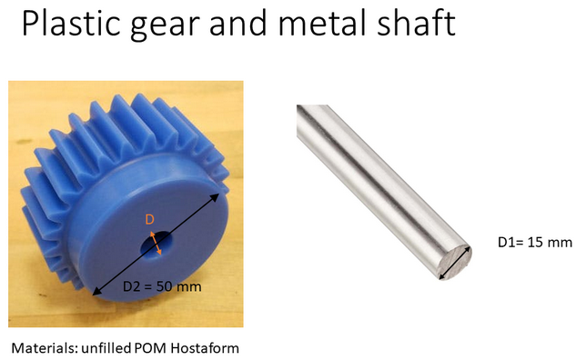

A) 800 N/mm²

B) 1000 N/mm²

C) 1500 N/mm²

D) 1800 N/mm²

# Question 9
Press fit - (b)
In the previous assembly, if the inner diameter for the gear (D) is 14.85 mm, what is the max torque it can transmit after one year. Assume the friction coefficient is 0.1. Length of the shaft is 30 mm.

A) 66.23 Nm

B) 0.9935 Nm

C) 6623 Nmm

D) 9935 Nmm

# Question 10
The image shows a mark produced by the presence of an ejector for the demoulding of the part, which is a circular mark crossed by the weldline near the hole. However, the mark is rarely as deep as in the picture. The part is made of PP and it is a detail of a cheap product that you can buy in every supermarket. What do you think is the cause for such evident mark?
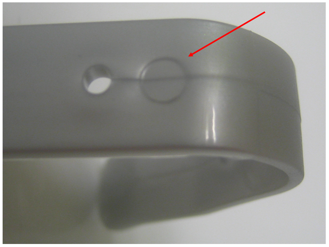

A) The injection speed was set too high.

B) The melt temperature was set too high.

C) The cooling time was set too short.

D) The packing pressure was set too low.

E) The melt temperature was set too low.

# Question 11
Based on the pvT plot of PP and PC-ABS, and assuming that both materials have a gate freeze temperature of 135 °C, please calculate the volumetric shrinkage of both materials.
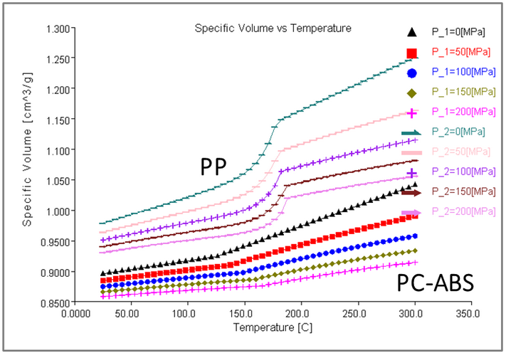

A) Volumetric shrinkage of PP = 6%, Volumetric shrinkage of PC-ABS = 3%

B) Volumetric shrinkage of PP = 8%, Volumetric shrinkage of PC-ABS = 4%

C) Volumetric shrinkage of PP = 6%, Volumetric shrinkage of PC-ABS = 6%

D) Volumetric shrinkage of PP = 8%, Volumetric shrinkage of PC-ABS = 2%

# Question 12
Based on the pvT plot of PP and PC-ABS, and assuming that both materials have a gate freeze temperature of 135 °C, please calculate the linear shrinkage of both materials.

A) Linear shrinkage of PP = 2%; linear shrinkage of PC-ABS = 2%.

B) Linear shrinkage of PP = 1%; linear shrinkage of PC-ABS = 1%.

C) Linear shrinkage of PP = 2%; linear shrinkage of PC-ABS = 1%.

D) Linear shrinkage of PP = 1%; linear shrinkage of PC-ABS = 2%.

# Question 13
In plastic product design sharp corners should be avoided because:
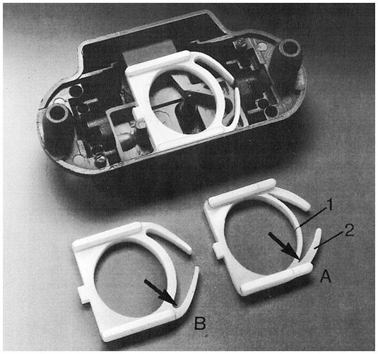

A) a large corner radius has lower shrinkage and therefore low warpage.

B) a small radius has a longer cooling time.

C) a small radius is difficult to fill and needs a higher injection pressure during injection moulding.

D) a large radius decreases stress concentration.

# Question 14
Consider the chart here below and select the correct statement.
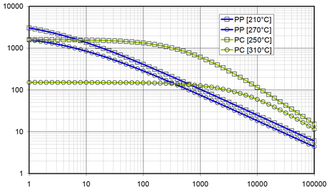

A) The image represents the plot of creep modulus of PP and PC at two different temperatures (210°C and 270°C for PP, 250°C and 310°C for PC) as a function of time in Log-Log scales. The X axis represents time, and the unit is hours [h]. The Y axis represents creep modulus, and the unit is megapascal [MPa].

B) The image represents the plot of viscosity of PP and PC at two different temperatures (210°C and 270°C for PP, 250°C and 310°C for PC) as a function of time in Log-Log scales. The X axis represents time, and the unit is hours [h]. The Y axis represents viscosity, and the unit is Pascal per second [Pa·s].

C) The image represents the plot of relaxation modulus of PP and PC at two different temperatures (210°C and 270°C for PP, 250°C and 310°C for PC) as a function of time in Log-Log scales. The X axis represents time, and the unit is seconds [s]. The Y axis represents creep modulus and the unit is Pascal [Pa].

D) The image represents the plot of viscosity of PP and PC at two different temperatures (210°C and 270°C for PP, 250°C and 310°C for PC) as a function of time in Log-Log scales. The X axis represents shear rate, and the unit is 1/seconds [1/s]. The Y axis represents viscosity and the unit is Pascal per second [Pa·s].

E) The image represents the plot of creep compliance of PP and PC at two different temperatures (210°C and 270°C for PP, 250°C and 310°C for PC) as a function of time in Log-Log scales. The X axis represents time, and the unit is hours [h]. The Y axis represents creep modulus, and the unit is 1/Pascal [1/Pa].

F) The image represents the plot of viscosity of PP and PC at two different temperatures (210°C and 270°C for PP, 250°C and 310°C for PC) as a function of time in Log-Log scales. The X axis represents time, and the unit is hours [h]. The Y axis represents viscosity, and the unit is Pascal [Pa].

# Question 15
The plot here below represents the stress-strain curve of a thermoplastic material. Please calculate the secant modulus at 1% of this material and select the correct answer among those reported below.
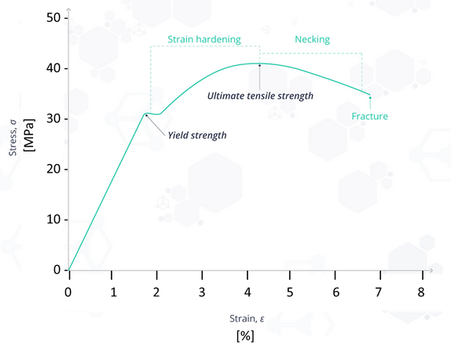

A) Secant modulus at 1% = 17.5 MPa

B) Secant modulus at 1% = 17.5 GPa

C) Secant modulus at 1% = 175 MPa

D) Secant modulus at 1% = 1.75 MPa

E) Secant modulus at 1% = 1.75 GPa

F) Secant modulus at 1% = 1750 GPa

# Question 16
The table here below presents the Creep Modulus (in MPa) of polyamide 12 (PA12) at three temperatures (20 °C, 60 °C, 100 °C) and at five different times (1 h, 10 h, 100 h, 1000 h, 10000 h). Please calculate the corresponding Creep Compliance of this material at the three temperatures (20 °C, 60 °C, 100 °C) and five times (1 h, 10 h, 100 h, 1000 h, 10000 h). Select the correct answer among those listed below.
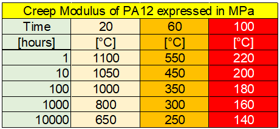

A) Creep Compliance of PA12 expressed in MPa: 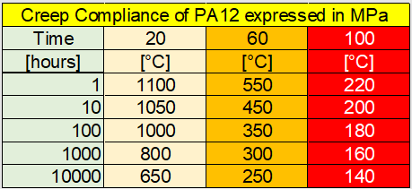

B) Creep Compliance of PA12 expressed in 1/Pa: 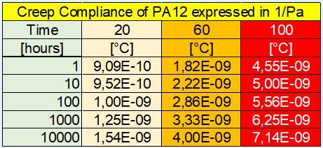

C) Creep Compliance of PA12 expressed in 1/Pa: 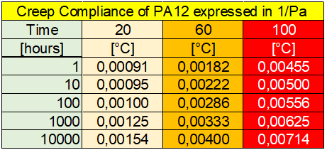

D) Creep Compliance of PA12 expressed in 1/MPa: 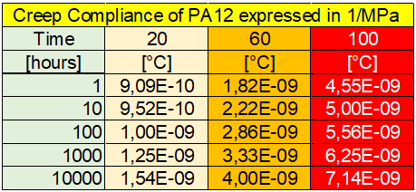

E) Creep Compliance of PA12 expressed in Pa: 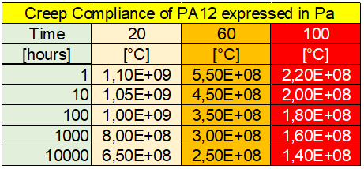

# Question 17
The table here below presents the Creep Modulus (in MPa) of polyamide 12 (PA12) at three temperatures (30 °C, 50 °C, 70 °C) and at five different times (1 h, 10 h, 100 h, 1000 h, 10000 h). Please calculate the strain of this material after 10 hours load at a stress of 5 MPa at 70 °C, followed by 1 hour load at no load at 30 degrees. Select the answer among those indicated below.
Note 1 – The reference temperature of this material is 40 °C.
Note 2 – Please use 30 °C as calculation temperature.
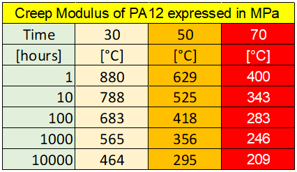

A) Strain = 0.11

B) Strain = 0.51

C) Strain = 0.0051

D) Strain = 0.051%

E) Strain = 1.1%

# Question 18
The table here below presents the Creep Modulus (in MPa) of polyamide 12 (PA12) at three temperatures (30 °C, 50 °C, 70 °C) and at five different times (1 h, 10 h, 100 h, 1000 h, 10000 h). Please calculate the strain of this material after 10 hours load at a stress of 5 MPa at 50 °C, followed by 1 hour load at no load at 30 degrees. Select the answer among those indicated below.
Note 1 – The reference temperature of this material is 40 °C.
Note 2 – Please use 30 °C as calculation temperature.

A) Strain = 0.84%

B) Strain = 0.27%

C) Strain = 0.84

D) Strain = 0.27

E) Strain = 0.084

F) Strain = 0.027

# Question 19
The table here below presents the Creep Modulus (in MPa) of polyamide 12 (PA12) at three temperatures (30 °C, 50 °C, 70 °C) and at five different times (1 h, 10 h, 100 h, 1000 h, 10000 h). Please calculate the strain of this material after 10 hours load at a stress of 5 MPa at 70 °C, followed by 10 hours load at no load at 30 degrees. Select the answer among those indicated below.
Note 1 – The reference temperature of this material is 40 °C.
Note 2 – Please use 30 °C as calculation temperature.

A) Strain = 1.1

B) Strain = 1.1%

C) Strain = 0.11

D) Strain = 0.44

E) Strain = 0.44%

F) Strain = 0.044

# Question 20
Consider the loading situations in previous 3 exercises. Please select the correct answer among the following statements.

A) By decreasing the temperature during the loading period, the final strain increases because the material has higher creep modulus.

B) By increasing the time with zero stress after the loading period the final strain decreases because the material has more time to recover.

C) By decreasing the temperature during the loading period, the final strain increases because the material has higher creep compliance.

D) By increasing the time with zero stress after the loading the final strain increases because the material has longer relaxation.

E) By increasing the temperature during the loading period, the final strain increases because the material has higher creep modulus.
